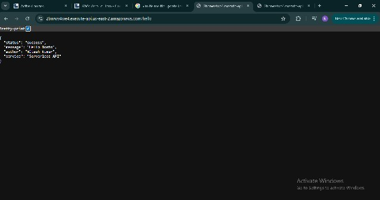
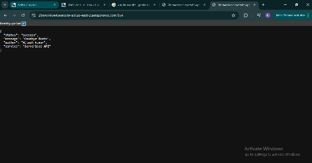
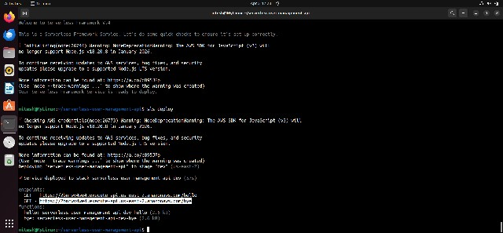

# 🚀 Serverless User Management API

This project is a Serverless REST API built using AWS Lambda, API Gateway, DynamoDB, and Serverless Framework.

It demonstrates how to build and deploy a scalable backend without managing servers.

---

# 📌 Features

- Serverless architecture (No server management)
- REST API using AWS API Gateway
- Data storage with DynamoDB
- Fast and scalable backend
- Easy deployment using Serverless Framework
- Cloud-based backend using AWS

---

# 🛠️ Tech Stack

- AWS Lambda
- AWS API Gateway
- AWS DynamoDB
- Serverless Framework
- Python
- Node.js

---

# 🔗 API Endpoint

## Create User API

POST

```bash
https://ri9qb7xmba.execute-api.us-east-2.amazonaws.com/dev/create-user
```

---

# 📦 Sample Request

```bash
curl -X POST "https://ri9qb7xmba.execute-api.us-east-2.amazonaws.com/dev/create-user" \
-H "Content-Type: application/json" \
-d '{"name":"Nitesh","email":"nitesh@gmail.com"}'
```

---

# ✅ Sample Response

```json
{
  "message": "User Created Successfully",
  "data": {
    "userId": "4757c9f3-78b5-4044-b9fb-405a09d29e6d",
    "name": "Nitesh",
    "email": "nitesh@gmail.com"
  }
}
```

---

# ⚙️ Setup & Deployment

## Install Serverless Framework

```bash
npm install -g serverless
```

## Configure AWS

```bash
aws configure
```

## Deploy Project

```bash
serverless deploy
```

---

# 🧪 Test API

```bash
curl -X POST "https://ri9qb7xmba.execute-api.us-east-2.amazonaws.com/dev/create-user" \
-H "Content-Type: application/json" \
-d '{"name":"Nitesh","email":"nitesh@gmail.com"}'
```

---

# 📂 Project Structure

- `handler.py` → Lambda function code
- `serverless.yml` → Serverless configuration
- `README.md` → Project documentation
- `index.html` → Simple frontend UI

---

# 🚀 Future Improvements

- Add GET API
- Add DELETE API
- Add Update User API
- Add Authentication

- ---

# 📸 Project Screenshots

## 🚀 Successful Deployment



---

## ✅ Successful API Response



---

## 🗄️ DynamoDB Table



---

## 📊 DynamoDB Stored Data


---

## 📂 Project Files


---

## 💻 Frontend GUI

(Add GUI screenshot here)

---

## ⚡ Lambda Function

(Add Lambda screenshot here)
- Add Frontend Deployment
- CI/CD
